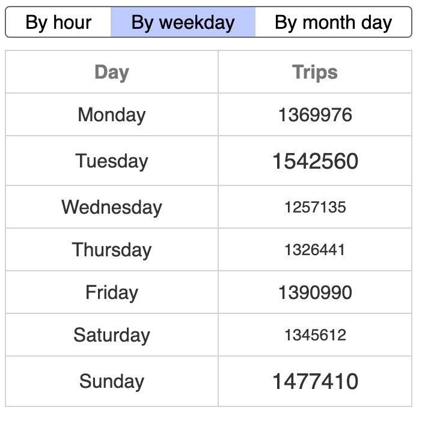

# NYC yellow cab trips widget

## Requirements

The only required tooling is node (tested with v22.9.0) and npm (tested with v10.8.3).

## Use

- Installing dev dependencies for testing

```
> npm install
```

- Testing the application

```
> npm run test:unit
> npm run test:integration

# Optional: if no Playwright browsers in the system
> npx playwright install 

> npm run test:e2e
```

- HTTP server

```
> npm run serve
```

The application will be ready to use at <http://127.0.0.1:8080>

# About the data

The data seem to be a list of the trips from the NYC Taxi Co. Each data point looks like a trip with information about time (pickup, dropoff), location (pickup, dropoff), distance, and cost (rate, fare, taxes, surcharges, payment). At the beginning I thought about creating some kind of widget that would help drivers showing them the more profitable times to be driving but realized that _vendorid_ attribute was not really about the driver but some kind of internal department division (?). Then I thought about the other kind of user for this data that would be the company management and what could they be interested about. Some reasonable assumption would be that they have to choose how many taxis should be working based on demand, so the widget is designed to show them an idea of the relative demand at different periods of time. A table with the info (grouped by hour, weekday or day of month) is used where the font size of the trips number varies depending on some thresholds. On top of it there are buttons to change the grouping.



Probably some kind of graph will be better for this kind of visualizacion, but it would have been more difficult then how to show the testing process as only some kind of snapshot diff testing would have been really possible. Another thing to take into account is that only a small sample of the total data was available (around a month worth of data) so other possible groupings were not really possible.

# Design decissions

As one of the requirements of the task is not being able to us any kind of framework, I have choosen to use standard web components to be able to encapsulate code. This led to some problems specially due to losing the reactivity that web frameworks normally provide that allow for creating simple architectures with data flowing in just one direction. There is some ugly code around (like this binding in [trips-widget.js](src/trips-widget.js#L18)) that would also be hidden by using web frameworks.

For testing, what I normally do is creating an e2e test that covers the normal workflow of a user (in this case loads the component, and checks every filter) just covering the "happy path". To test other edge cases or specific situations that could arise for a component I use unit (component) testing where the component is treated as a function with some inputs (props, user input) and some outputs (what is shown on screen). To check that API calls are correcly made I have used some integration tests that are separated from unit test due to them being relatively slow (that way both can be run independently).

# Possible improvements

As a limited project (both in time and scope), some corners have been cut to finish the task. Some things that should be changed for making it more production ready code would be:

- Dealing with errors: specially those than can possible come from API calls.
- Project folder organizacion: all the code is in the same folder, but in a production ready environment we would have to think of a way of organizing it so other parts of the app will share space.
- Caching: some of the API calls could be computationally expensive (an slow) depending on the endpoint implementation. Depending on the use case some kind of caching on the browser side could be implemented.
- Testing robustness: locators used for testing are really simple (just id's and classes) and could make the tests somewhat flimsy due to changes in implementation. A better way of doing it will be using element roles that does not depend on their implementation.
- Templating system for HTML: current HTML code is mostly added to components using a JS string and this mades it difficult and prone to error to edit it. Being able to write the HTML in their own files (or some other)

